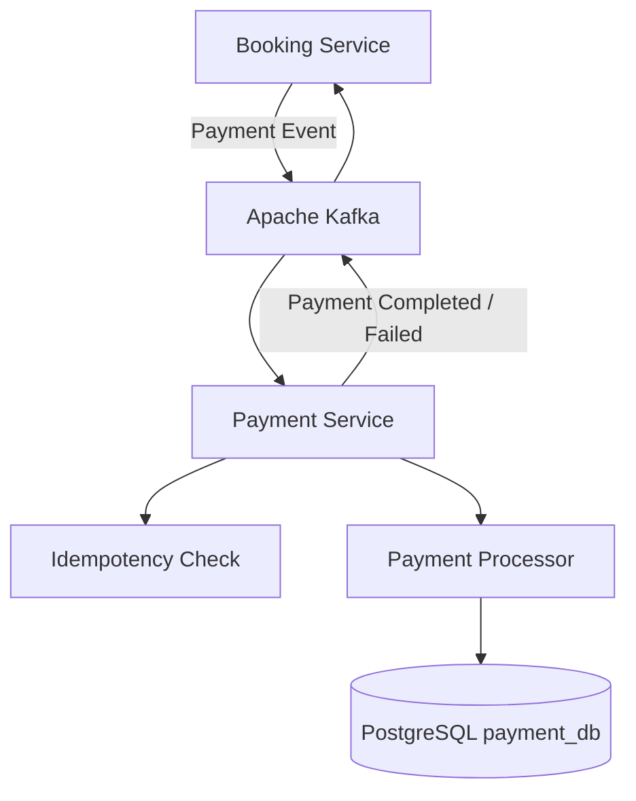

# Event Ticketing - Payment Service

## 📌 Overview

`event-ticketing-payment-service` is the core microservice responsible for managing payment processing, payment status tracking, and asynchronous payment event execution within the Event Ticketing System.

## 🏗️ Service Responsibilities

* Processing booking payment requests asynchronously via Kafka events.
* Handling idempotency to prevent duplicate payment processing.
* Managing payment transaction states (`PENDING`, `COMPLETED`, `FAILED`).
* Publishing payment completion and failure events to Kafka.

## 🛠️ Tech Stack

* **Language:** Node.js / TypeScript
* **Framework:** NestJS
* **ORM:** Prisma ORM / TypeORM
* **Database:** PostgreSQL (`payment_db`)
* **Messaging:** Apache Kafka
* **Containerization:** Docker

## 📐 Architecture

